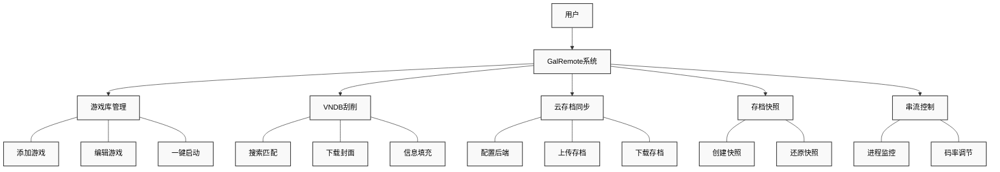

# 第3章 需求分析

本章对 GalRemote 系统进行全面的需求分析，包括功能概述、功能性需求、非功能性需求和可行性分析，为后续的系统设计与实现奠定基础。

## 3.1 功能概述

GalRemote 是一款专为 Galgame（视觉小说）玩家设计的游戏串流管理平台，基于开源串流服务器 Sunshine 进行深度定制开发。系统旨在解决 Galgame 玩家在游戏管理、存档同步和远程游玩方面的痛点，提供从游戏库管理到云端串流的一站式解决方案。

系统的核心设计目标包括以下五个方面：第一，统一管理，即集中管理分散在各处的 Galgame 游戏，构建个人游戏库；第二，信息聚合，通过集成 VNDB API 自动获取游戏元数据，构建可视化的游戏信息展示界面；第三，存档安全，实现多端云同步和版本快照功能，有效防止存档丢失；第四，远程游玩，使用户能够在移动设备上通过串流技术畅玩 PC 端 Galgame；第五，智能串流，通过自适应码率控制算法保证画质与流畅度的平衡。

系统采用三层架构设计，由控制面板层、后端服务层和串流核心层组成。控制面板层基于 Tauri + Vue 3 技术栈实现，提供游戏库管理、云同步配置、存档管理和串流设置等用户交互界面。后端服务层使用 Rust 语言开发，负责 VNDB API 调用、OpenDAL 云存储操作、游戏进程监控和 HTTP 代理服务等核心业务逻辑。串流核心层集成 Sunshine 开源项目（C++），负责视频编码、音频采集、输入转发和网络传输等底层串流功能。图3-1展示了系统的总体功能结构。

图3-1 系统总体功能图

## 3.2 功能性需求

功能性需求描述了系统需要实现的具体功能，本节从游戏库管理、VNDB 自动刮削、云存档同步、存档快照管理和串流控制五个模块分别进行详细阐述。

### 3.2.1 游戏库管理模块

游戏库管理模块是系统的核心功能模块之一，负责 Galgame 游戏的添加、编辑、删除、搜索和分类管理。该模块为用户提供统一的游戏管理界面，使分散在不同目录的游戏能够集中展示和管理。

表3-1 游戏库管理模块功能需求

| 编号 | 功能名称 | 功能描述 | 优先级 |
|:---:|:---:|:---|:---:|
| F1.1 | 游戏添加 | 支持手动添加游戏，指定游戏名称、启动路径、存档路径等信息 | 高 |
| F1.2 | 游戏编辑 | 修改已添加游戏的各项配置信息，包括名称、路径、状态等 | 高 |
| F1.3 | 游戏删除 | 从游戏库中移除游戏记录（不删除本地游戏文件） | 高 |
| F1.4 | 游戏搜索 | 支持按游戏名称、开发商、状态等条件检索游戏 | 中 |
| F1.5 | 游戏分类 | 支持按游戏状态（未开始/进行中/已完成）进行筛选展示 | 中 |
| F1.6 | 一键启动 | 从控制面板直接启动游戏并自动开始串流会话 | 高 |

### 3.2.2 VNDB 自动刮削模块

VNDB 自动刮削模块通过集成 VNDB（Visual Novel Database）API，实现游戏元数据的自动获取和填充。该模块能够根据游戏名称自动搜索匹配的游戏条目，下载封面图片，并填充开发商、发售日期、游戏简介等信息，大幅降低用户手动整理游戏库的工作量。

表3-2 VNDB 自动刮削模块功能需求

| 编号 | 功能名称 | 功能描述 | 优先级 |
|:---:|:---:|:---|:---:|
| F2.1 | 元数据搜索 | 通过游戏名称调用 VNDB API 搜索匹配的游戏条目列表 | 高 |
| F2.2 | 封面下载 | 自动下载游戏封面图片并缓存到本地 | 高 |
| F2.3 | 信息填充 | 自动填充开发商、发售日期、游戏简介、评分等元数据 | 高 |
| F2.4 | 手动匹配 | 当自动搜索结果不准确时，支持用户手动选择正确的游戏条目 | 中 |
| F2.5 | 批量刮削 | 支持对多个游戏批量执行元数据刮削操作 | 低 |

### 3.2.3 云存档同步模块

云存档同步模块基于 Apache OpenDAL 统一存储抽象层实现，支持多种云存储后端，包括 WebDAV、S3 兼容存储、阿里云 OSS 等。该模块使用户能够将游戏存档同步到云端，实现跨设备的存档共享，有效解决多设备间存档同步的问题。

表3-3 云存档同步模块功能需求

| 编号 | 功能名称 | 功能描述 | 优先级 |
|:---:|:---:|:---|:---:|
| F3.1 | 存储后端配置 | 支持配置 WebDAV、S3、阿里云 OSS、OneDrive 等存储服务 | 高 |
| F3.2 | 存档上传 | 将本地存档目录同步上传至云端存储 | 高 |
| F3.3 | 存档下载 | 从云端存储拉取存档到本地目录 | 高 |
| F3.4 | 镜像同步 | 保持本地与云端存档状态完全一致的双向同步 | 高 |
| F3.5 | 冲突处理 | 智能检测并处理多端同时修改产生的存档冲突 | 中 |
| F3.6 | 增量同步 | 仅同步发生变化的文件，节省带宽和时间 | 中 |

### 3.2.4 存档快照管理模块

存档快照管理模块提供存档的版本管理功能，支持自动和手动创建存档快照，并可随时将存档回滚到指定的历史版本。该模块为用户提供了存档安全的最后一道保障，有效防止因误操作或游戏崩溃导致的存档损坏。

表3-4 存档快照管理模块功能需求

| 编号 | 功能名称 | 功能描述 | 优先级 |
|:---:|:---:|:---|:---:|
| F4.1 | 自动快照 | 游戏退出时自动创建当前存档的快照备份 | 高 |
| F4.2 | 手动快照 | 支持用户在任意时刻主动创建存档快照 | 中 |
| F4.3 | 快照浏览 | 可视化展示所有历史快照，包括创建时间和备注 | 中 |
| F4.4 | 快照还原 | 将存档回滚到指定的快照版本 | 高 |
| F4.5 | 快照删除 | 删除不再需要的历史快照以释放存储空间 | 低 |

### 3.2.5 串流控制模块

串流控制模块负责游戏串流会话的管理和控制，包括游戏进程监控、游玩时长统计、虚拟显示器管理和动态码率调整等功能。该模块是实现远程游玩功能的核心，直接影响用户的串流体验质量。

表3-5 串流控制模块功能需求

| 编号 | 功能名称 | 功能描述 | 优先级 |
|:---:|:---:|:---|:---:|
| F5.1 | 进程监控 | 实时监控游戏进程状态，记录启动和退出时间 | 高 |
| F5.2 | 游玩统计 | 累计记录每个游戏的游玩时长和游玩历史 | 中 |
| F5.3 | 虚拟显示器 | 管理虚拟显示器，支持动态分辨率调整 | 中 |
| F5.4 | WebUI 代理 | 内置 HTTP 代理服务器，嵌入 Sunshine 原生 WebUI | 中 |
| F5.5 | 动态码率调整 | 根据网络状态实时调整视频编码码率 | 高 |

## 3.3 非功能性需求

非功能性需求描述了系统在性能、可靠性、安全性、可用性等方面需要满足的质量标准。

### 3.3.1 性能需求

系统需要在保证功能完整性的前提下，满足一定的性能指标要求，以提供流畅的用户体验。

表3-6 系统性能需求

| 编号 | 需求描述 | 指标要求 |
|:---:|:---|:---:|
| NF1.1 | 应用启动时间 | 冷启动 ≤ 3 秒 |
| NF1.2 | 游戏库加载速度 | 1000 个游戏条目加载 ≤ 1 秒 |
| NF1.3 | VNDB 搜索响应时间 | API 响应 ≤ 2 秒（受网络影响） |
| NF1.4 | 内存占用 | 空闲状态 ≤ 150 MB |
| NF1.5 | CPU 占用 | 空闲状态 ≤ 2% |
| NF1.6 | 串流延迟 | 端到端延迟 ≤ 50ms（局域网环境） |

### 3.3.2 可靠性需求

系统需要具备良好的可靠性，确保用户数据的安全性和系统运行的稳定性。

表3-7 系统可靠性需求

| 编号 | 需求描述 | 实现策略 |
|:---:|:---|:---|
| NF2.1 | 数据持久化 | 游戏库数据采用 JSON 文件存储，支持备份恢复 |
| NF2.2 | 崩溃恢复 | 异常退出后重启可恢复到最近状态 |
| NF2.3 | 存档安全 | 还原操作前自动创建备份快照 |
| NF2.4 | 同步事务性 | 同步过程中断不会导致数据损坏 |

### 3.3.3 安全性需求

系统需要保护用户的隐私数据和敏感凭证，确保数据传输和存储的安全性。

表3-8 系统安全性需求

| 编号 | 需求描述 | 实现策略 |
|:---:|:---|:---|
| NF3.1 | 凭证存储 | 云存储凭证加密存储，不以明文形式保存 |
| NF3.2 | 传输安全 | 云同步采用 HTTPS/TLS 加密传输 |
| NF3.3 | 本地权限 | 仅访问用户授权的游戏和存档目录 |
| NF3.4 | 隐私保护 | 不收集或上传任何用户隐私数据 |

### 3.3.4 可用性需求

系统需要提供友好的用户界面和交互体验，降低用户的学习成本。

表3-9 系统可用性需求

| 编号 | 需求描述 | 实现策略 |
|:---:|:---|:---|
| NF4.1 | 界面一致性 | 遵循统一的设计语言和交互规范 |
| NF4.2 | 响应式反馈 | 所有操作提供即时视觉反馈 |
| NF4.3 | 错误提示 | 错误信息清晰易懂，提供解决建议 |
| NF4.4 | 多语言支持 | 界面支持中英文切换 |
| NF4.5 | 主题切换 | 支持深色/浅色主题 |

### 3.3.5 兼容性需求

系统需要在目标平台上稳定运行，并与相关的外部系统兼容。

表3-10 系统兼容性需求

| 编号 | 需求描述 | 支持范围 |
|:---:|:---|:---|
| NF5.1 | 操作系统 | Windows 10 22H2 及以上版本 |
| NF5.2 | 显卡支持 | NVIDIA GTX 10 系列及以上，AMD RX 5000 系列及以上 |
| NF5.3 | 客户端兼容 | Moonlight 全平台客户端 |
| NF5.4 | 云存储兼容 | WebDAV、S3 兼容存储、阿里云 OSS、MinIO |

## 3.4 可行性分析

本节从技术可行性、经济可行性和操作可行性三个维度对项目进行可行性论证。

### 3.4.1 技术可行性

本系统采用的核心技术栈均为业界成熟且广泛应用的技术方案。前端采用 Vue 3 + Composition API 和 Element Plus 组件库，两者均为生产就绪的稳定框架。桌面应用框架采用 Tauri 2.x，相比 Electron 具有更小的安装包体积和更低的内存占用。后端采用 Rust 语言开发，其内存安全特性和高并发处理能力能够满足系统对性能和稳定性的要求。云存储集成采用 Apache OpenDAL，这是 Apache 基金会孵化的开源项目，支持多种存储协议且社区活跃。串流核心集成 Sunshine 开源项目，该项目已被广泛应用于开源云游戏领域，技术方案成熟可靠。

表3-11 核心技术栈成熟度评估

| 技术领域 | 采用技术 | 成熟度评估 |
|:---:|:---:|:---:|
| 前端框架 | Vue 3 + Composition API | 生产就绪，生态完善 |
| UI 组件库 | Element Plus | 企业级组件库 |
| 桌面框架 | Tauri 2.x | 新一代桌面框架 |
| 后端语言 | Rust | 内存安全，高性能 |
| 云存储集成 | Apache OpenDAL | Apache 孵化项目 |
| 串流核心 | Sunshine | 开源成熟方案 |

综上所述，本项目所采用的技术栈成熟可靠，开发工具完善，具备良好的技术可行性。

### 3.4.2 经济可行性

本项目的开发成本主要为时间投入，无显著的硬件和软件购置成本。开发环境使用已有的个人电脑，所有开发工具和框架均为开源或免费软件，持续集成服务使用 GitHub Actions 免费额度，测试设备使用已有的手机和平板。因此，本项目开发成本极低，无显著经济风险，具备良好的经济可行性。

### 3.4.3 操作可行性

系统采用现代化的 UI 设计语言，界面简洁直观，支持深色和浅色主题切换以适应不同使用环境。安装部署方面，系统提供 Windows 一键安装包和便携版两种形式，用户可根据需求选择，无需复杂的配置流程即可使用。目标用户群体为 Galgame 玩家，通常具备一定的计算机操作基础，熟悉游戏管理和存档的相关概念，能够理解和使用系统提供的各项功能。因此，本系统具备良好的操作可行性。

表3-12 可行性分析结论

| 分析维度 | 评估结果 | 风险等级 |
|:---:|:---:|:---:|
| 技术可行性 | 可行 | 低 |
| 经济可行性 | 可行 | 极低 |
| 操作可行性 | 可行 | 低 |

## 3.5 本章小结

本章对 GalRemote 系统进行了全面的需求分析。在功能概述部分，明确了系统的五大核心设计目标和三层架构设计，并通过系统总体功能图直观展示了系统的功能结构。在功能性需求部分，从游戏库管理、VNDB 自动刮削、云存档同步、存档快照管理和串流控制五个模块详细描述了系统需要实现的 27 项功能需求。在非功能性需求部分，从性能、可靠性、安全性、可用性和兼容性五个维度制定了系统的质量标准，共计 19 项非功能性需求。在可行性分析部分，从技术、经济和操作三个维度论证了项目的可行性，结论表明项目具备良好的实施条件，整体风险等级较低。本章的需求分析结果将作为后续系统设计与实现的基础，指导开发工作的有序推进。
