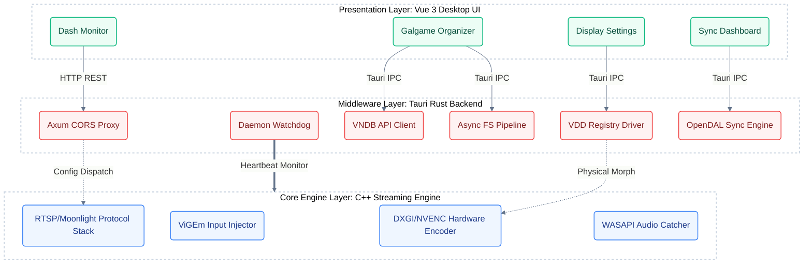
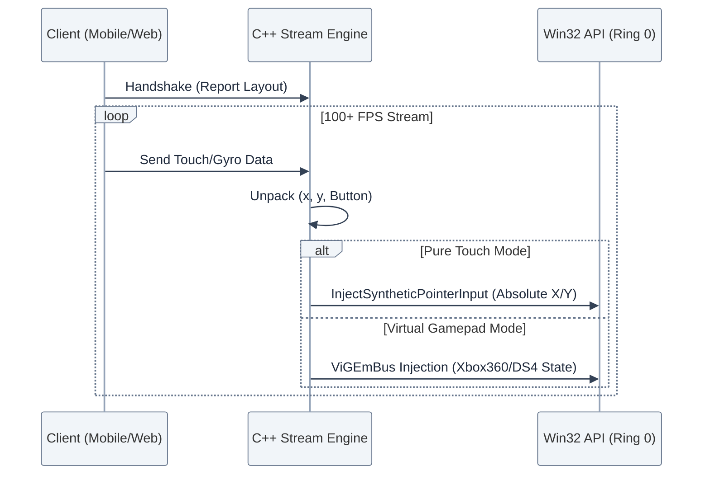
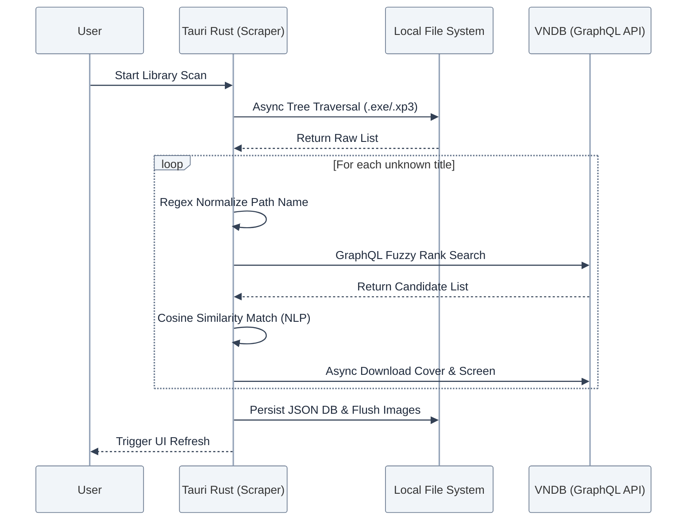
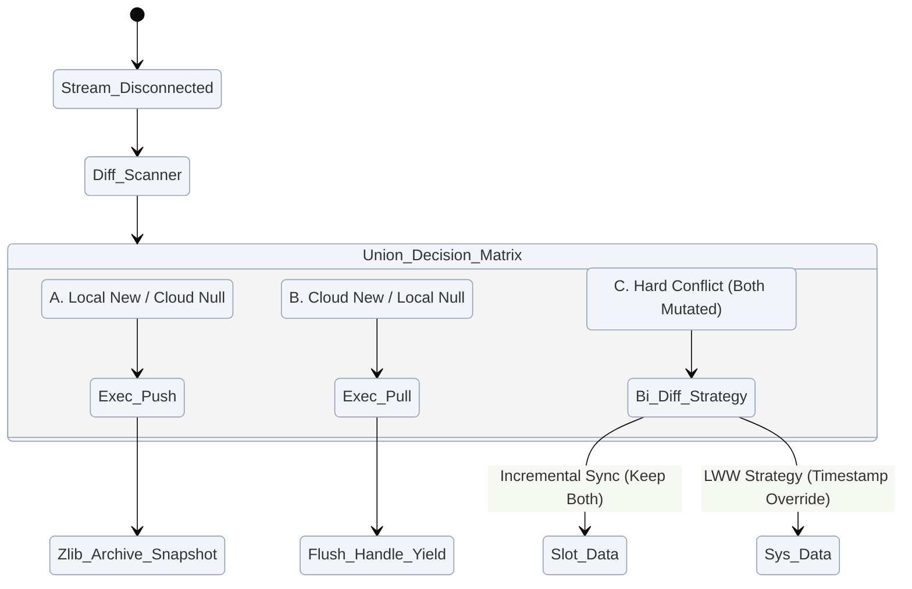
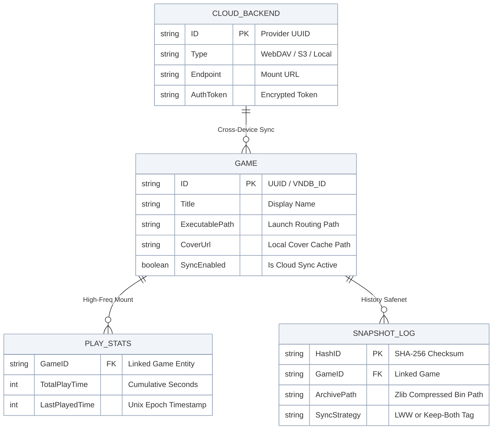

# 第4章 概要设计

基于第3章中提出的各项功能需求（跨端串流接管、Galgame 原生库管理、云存档并集同步等）与非功能需求（超低串流延迟、轻量化资源占用），本章将详细阐述 GalRemote 系统的整体架构与各个核心功能模块的内部设计。为满足上述严苛要求，本系统采用了**“C++ 底层引擎驱动 + Rust 中台层管理 + Vue3 现代化前端呈现”**的三层分离架构，从而有效解决跨端串流与状态同步的技术难题。

## 4.1 系统架构设计

为保证串流的超低延迟并跨越不同操作系统的底层 API 壁垒，同时考虑到 GUI 面板的高度可扩展性，本系统摒弃了传统的单一单体架构，转而采用了基于 **Tauri** 跨平台框架配合本地代理协议的混合型物理与逻辑架构。

### 4.1.1 物理与逻辑架构模型

系统整体划分为 **三大核心层（Three-Tier Architecture）**，如下图所示：

1. **C++ 串流底层引擎（Streaming Core Engine Layer）**
   - **定位**：系统的大脑神经与骨骼，承担低延迟串流性能需求。
   - **职责**：直接同操作系统 API 交互，负责桌面画面捕获（如 Windows DXGI）、音频捕获（WASAPI）、硬件视频编码，以及高频的外设输入信号注入。

2. **Rust 面板中台层（Tauri Backend / Middleware Layer）**
   - **定位**：连接底层服务与顶层 UI 的中枢，承接“跨平台管理”与“结构化扫描”的核心业务。
   - **职责**：提供虚拟硬件挂载（VDD Model）、Galgame 硬盘目录的并发扫描、VNDB (Visual Novel Database) 原生 API 刮削，以及实现跨协议云存档同步逻辑。

3. **Vue 3 现代化前端层（Presentation Layer）**
   - **职责**：通过自研桌面 UI 框架，在不妥协性能的前提下提供贴近原生应用的交互体验，包括窗口管理、瀑布流展示与存档时间机器等界面。

---

## 4.2 功能模块设计

针对系统整体的宏观设计，我们需要将其拆解为独立协同运转的各个业务模块。

### 4.2.1 串流控制模块

为满足“移动端全功能指控”的需求，串流控制模块的设计重点在于“无感介入”与“资源动态匹配”。
- **引擎进程管控与心跳设计**：由于底层可能因显卡驱动等外部因素崩溃，面板应用（Tauri）采用伴随模式管理引擎。当检测到 `sunshine.exe` 退出码异常时，Rust 后端可在 500ms 内收集日志并重新拉起服务。
- **虚拟操作接管**：客户端握手时报告布局，系统通过解包坐标流，动态调用 `InjectSyntheticPointerInput` 或 `ViGEmBus` 对系统执行指令注入。

### 4.2.2 游戏库管理与刮削模块

针对“海量未结构化游戏目录管理困难”，该模块使用并发算法将其转换为结构化资产。使用 Rust 异步运行时结合 VNDB 的 GraphQL API进行处理，其时序如下：

### 4.2.3 智能云存档同步模块

为实现“任何地点、任何设备无缝接力”，由于 Galgame 包含全局系统记录文件（SystemData）与槽位快照文件（SlotData），简单的全量覆盖必然导致丢档。系统采用 **基于元数据快照的并集冲突解决算法**：

---

## 4.3 数据库设计

出于系统对主机的“极低侵入性”（零依赖、免安装）与极低资源开销的非功能性指标考量，本系统在架构树级摒弃了传统的 SQLite 或 MySQL 等重量级关系型数据库解决方案，转而采用了基于 Rust `serde_json` 的强类型 JSON 序列化技术。

为保证在前端状态树与后端 Rust 结构体、物理文件之间的数据一致性，系统规划了以下非关系型（NoSQL）文档的**核心实体关系 (Entity-Relationship) 模型**：

### 4.3.1 领域驱动设计下的冷热分离策略

在工程落地中，为了避免高频的“心跳追踪机制”引发磁盘 IO 风暴乃至写坏包含复杂属性的静态游戏元数据，本系统将大型结构体进行了**严格的冷热隔离**：

1. **静态配置流 (冷数据)**：`GAME` 的核心展现描述剥离为只读频率极高的配置文件（`galgames.config.json`），仅在刮削器更新或用户修改路径时发生落盘写操作。
2. **动态日志流 (热数据)**：`PLAY_STATS` 游玩统计独立映射为 `play_stats.json`，在系统推流挂钩时由后台线程以定期步长或进程退出时进行防抖写出。

两份数据字典在内存堆中进行“伪联表”（Pointer Reference），既保证了读取的高吞吐，又杜绝了存储层面的“脏写”与原子性被破坏的风险。

---

## 4.4 本章小结

本章围绕需求分析阶段的核心要点，详细描绘了 GalRemote 系统架构的顶层设计原貌。通过“表示层、中间件层、引擎层”这三层复合架构将繁琐的功能进行了有效解耦。接着在功能模块设计中，针对串流控制、自动刮削以及云存档同步确立了合理的时序逻辑与状态机表现。最后，借由无数据库的强类型 JSON 映射设计，进一步保障了系统免安装、防脏写的轻量特性。至此，整个系统的蓝图规划完毕，为下一章核心代码的实际工程编写打下了坚实基础。
