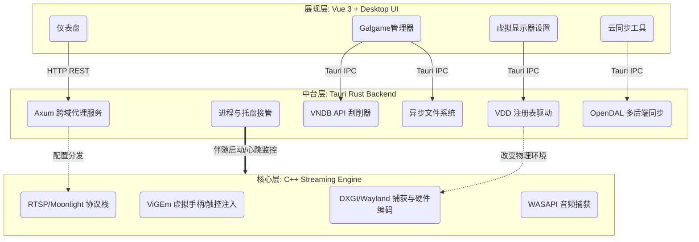
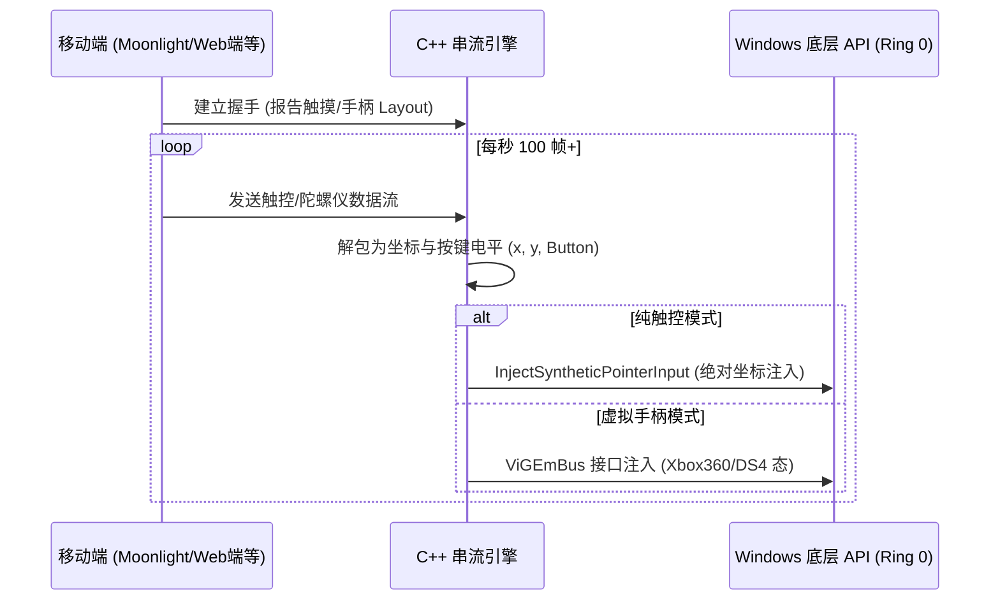
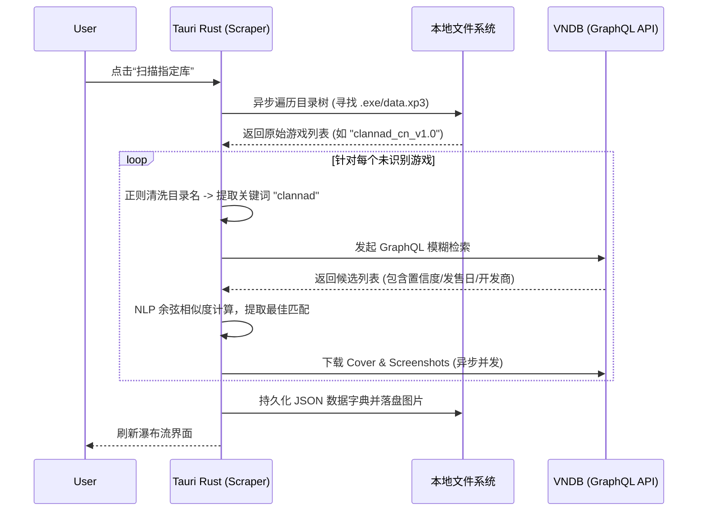
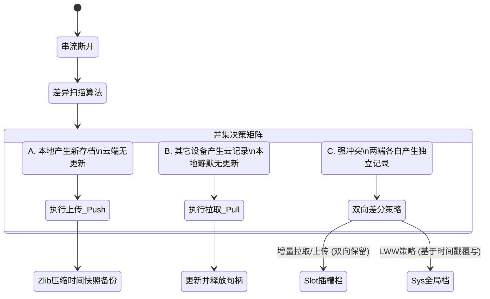
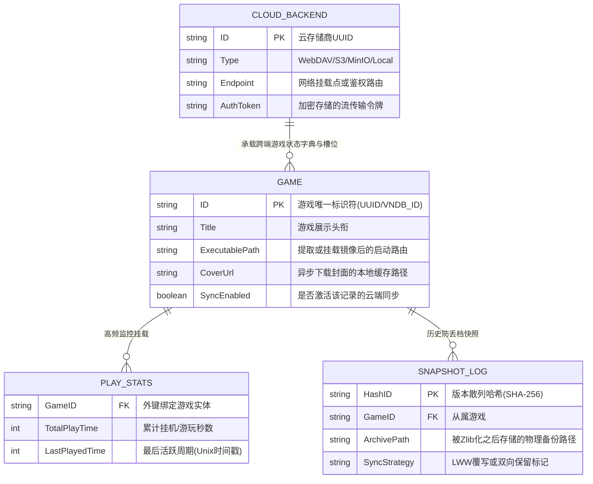

# 第四章 系统架构与详细设计

基于第三章中提出的各项功能需求（跨端串流接管、Galgame 原生库管理、云存档并集同步等）与非功能需求（超低串流延迟、轻量化资源占用），本章将详细阐述 GalRemote 系统的整体架构与各个核心功能模块的内部设计。为满足上述严苛要求，本系统采用了**“C++ 底层引擎驱动 + Rust 中台层管理 + Vue3 现代化前端呈现”**的三层分离架构，从而有效解决跨端串流与状态同步的技术难题。

## 4.1 系统整体架构设计

为保证串流的超低延迟并跨越不同操作系统的底层 API 壁垒，同时考虑到 GUI 面板的高度可扩展性，本系统摒弃了传统的单一单体架构，转而采用了基于 **Tauri** 跨平台框架配合本地代理协议的混合型物理与逻辑架构。

### 4.1.1 物理与逻辑架构模型

系统整体划分为 **三大核心层（Three-Tier Architecture）**，如下图所示：

1. **C++ 串流底层引擎（Streaming Core Engine Layer）**
   - **定位**：系统的大脑神经与骨骼，承担第三章中提出的“10ms 级低延迟串流”性能需求。
   - **职责**：直接同操作系统 API 交互，负责桌面画面捕获（如 Windows DXGI）、音频捕获（WASAPI）、硬件视频编码（NVIDIA NVENC / AMD AMF），以及高频的外设输入信号注入。

2. **Rust 面板中台层（Tauri Backend / Middleware Layer）**
   - **定位**：连接底层服务与顶层 UI 的中枢，承接“跨平台管理”与“结构化扫描”的核心业务。
   - **职责**：
     - **虚拟硬件管理（VDD Model）**：直接操作操作系统设备树，挂载虚拟显示器以匹配移动端分辨率。
     - **业务核心**：提供 Galgame 硬盘目录的并发扫描、VNDB (Visual Novel Database) 原生 API 刮削，以及实现跨协议云存档同步逻辑。

3. **Vue 3 现代化前端层（Presentation Layer）**
   - **职责**：通过自研的 Desktop UI 框架，在不妥协性能的前提下提供贴近原生应用的交互体验，包括窗口管理、瀑布流展示与存档时间机器等界面。

---

## 4.2 串流控制模块设计

为满足第三章 3.2 节中“移动端全功能指控”的需求，串流控制模块的设计重点在于“无感介入”与“资源动态匹配”。

### 4.2.1 引擎进程管控与心跳设计
由于 C++ 底层可能因显卡驱动等外部因素崩溃，面板应用（Tauri）采用伴随模式管理引擎。当检测到 `sunshine.exe` 退出码异常时，Rust 后端可在 500ms 内收集崩溃日志（通过重定向 Stdout）并重新拉起服务，对外表现为“无缝自愈”。

### 4.2.2 虚拟操作接管 (Virtual Input Inject)

### 4.2.3 虚拟显示器（VDD）自适应动态模型设计
传统串流常遭遇“带鱼屏推流到手机产生黑边”的问题。本模块通过 VDD (Virtual Display Device) 驱动实现：客户端握手时报告屏幕比例（如 21:9），Rust 中台层即刻通过命令行调用注入注册表，凭空生成一块该分辨率的虚拟显示器并设为主屏。断开时，自动剥离该显示器，恢复宿主机原有生态。

---

## 4.3 Galgame 库管理与刮削模块设计

针对第三章分析的“海量未结构化游戏目录管理困难”，该模块使用并发算法将其转换为结构化资产。

### 4.3.1 跨端数据刮削流程 (Scraper Workflow)

使用 Rust `tokio` 异步运行时结合 VNDB 的 GraphQL API进行处理，其时序如下：

---

## 4.4 智能云存档同步模块设计

为实现第三章 3.3 节强调的“任何地点、任何设备无缝接力”，本模块设计了无后端的双向并行同步机制。

### 4.4.1 镜像合并算法与多端冲突解决矩阵
由于 Galgame 包含全局系统记录文件（SystemData）与槽位快照文件（SlotData），简单的全量覆盖必然导致丢档。系统采用 **基于元数据快照的并集冲突解决算法**：

---

## 4.5 本地持久化存储与非关系型映射设计

出于系统对主机的“极低侵入性”（零依赖、免安装）与极低资源开销的非功能性指标考量，本系统在架构树级摒弃了传统的 SQLite 或 MySQL 等重量级关系型数据库解决方案，转而采用了基于 Rust `serde_json` 的强类型 JSON 序列化技术。

为保证在前端状态树（如 Vuex/Pinia）与后端 Rust 结构体、物理文件之间的数据一致性，系统规划了以下非关系型（NoSQL）文档的**核心实体关系 (Entity-Relationship) 模型**：

### 4.5.1 领域驱动设计下的冷热分离策略

在工程落地中，为了避免高频的“心跳追踪机制”（每秒更新游玩时长）引发磁盘 IO 风暴乃至写坏包含复杂属性的静态游戏元数据，本系统将大型结构体进行了**严格的冷热隔离**：

1. **静态配置流 (冷数据)**：`GAME` 的核心展现描述剥离为只读频率极高的配置文件（`galgames.config.json`），仅在刮削器更新或用户修改路径时发生落盘写操作。
2. **动态日志流 (热数据)**：`PLAY_STATS` 游玩统计独立映射为 `play_stats.json`，在系统推流挂钩时由 Rust 的后台线程以 5 分钟的步长或进程退出时进行防抖写出。

两份数据字典在 Tauri 中台的内存堆中进行“伪联表”（Pointer Reference），既保证了读取的高吞吐，又杜绝了存储层面的“脏写”与原子性被破坏的风险。
